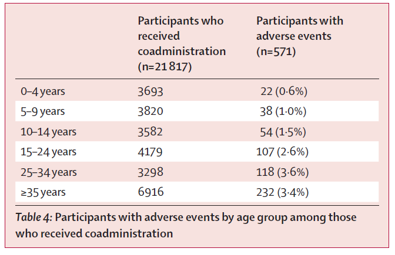

```{r setup, include=FALSE}
knitr::opts_chunk$set(echo = FALSE, cache = T, warning=F, message = F, fig.align='center', fig.pos = 'h', eval.after = "fig.cap")
```

Review one issue of a journal in your field for graphics that are used.


```{r cover, fig.cap = 'The cover of THE LANCET Global Health Year 2018, Volume 6, Number 10, e1045-e1138', out.width = "78%"}

```


1. What is the journal and the year/issue?  
**Journal: THE LANCET Global Health**  
**Issue: Year 2018, Volume 6, Number 10, e1045-e1138.**

2. How many papers are in this issue and how many graphs are there?  
**There are 5 articles, 5 corrections, 7 correspondence, 7 comments and 1 editorial. Here I restrict my analysis to the 5 articles. In total, there are 16 figures in these 5  aritcles.**

3. How many graphs involve plotting raw data (as opposed to things like regression lines that are computed from raw data)? (Some graphs may have both.)  
**There are 9 figures involving plotting raw data.**

4. Describe the clarity of titles and labels. For text within the plot (as opposed to the text in the caption) what font sizes are used? (Just approximate this using the information below.) What is the minimum size used?   
**The titles explain the contents using very concise sentences. They use bold 8 point type, the minimum size is 7.**

5. Select one graph from the issue of the journal you chose. Copy and paste this graph in your Word file. Analyze this graph with regard to the ACCENT principle.
- **Apprehension:** This figure uses the color of each polygon to describe the prevalence of insufficient physical activity in man and women across the world in 2016. I think it meets the apprehension principle.
- **Clarity:** The most important characteristic in the graph is the visualization of regional distribution of insufficient physical activity across the world. This regional distribution is also stratified by gender. It also meets this principle.
- **Consistency:** The universal standard for essential elements of geographical information system figures requires 1) north arrows, 2) scale bars, 3) scale text, 4) legends, 5) frames. In this figure, it seems that the north arrow, scale bars and scale text are missing from the figure. It does not meet the standard at least from the GIS standard.
- **Efficiency: ** The figure is intuitive and simple enough so that we can observe the regional distribution of global insufficient physical activity in 2016.
- **Necessity: ** The information can be absolutely better presented in this GIS figure since it would be much messier to explore the data in a tabular form. In this figure, the regional distribution is presented in its corresponding location.
- **Truthfulness: ** It meets the criterion of truthfulness. Its color reflects the prevalance of insufficient physical activity in 2016 and these colors are well structured. The only drawback is the arrow and scales are not provided in the plots. 

```{r fig1, fig.pos="h", echo=FALSE, fig.cap="The figure from a journal article", out.width = '100%'}
knitr::include_graphics("./Lancet Global Health/Article1Fig5.png")
```

6. If you removed the graph with its caption, could it stand alone and make it’s point without the accompanying text?  
**No. Although we can observe the distribution of these colors, we have no idea about the meaning of these colors and numbers.**

7. Suggest how the graph might be improved. If the graph cannot stand alone, what additional information would be needed to make it be able to stand alone?  
**I would suggest them to add the scale bar, scale text and north arrow.**

8. From the journal/year/issue, select five graphs at random and for each approximate the
height/width ratio. Compare these with the golden ratio 0.618.  
**I randomly chose 5 figures from the total 12 plots, and the height/width ratios are 0.921, 0.454, 1.050, 0.725, 0.583. The mean of these five ratios are 0.747, which is close to the golden ratio 0.618. However, when looking into the individual height/width ratios, only one of them (0.583) is close to the golden ratio. In general, it seems that the journal does not require the height-width ratio to be near the golden ratio.**

9. Select one table from the same year/issue of the journal. Copy and paste it into your Word file. Describe the purpose of the table, and whether you think it achieves it’s purpose.  
**This table from the article shows participants who received coadminstration and those with adverse events stratified by age groups. The table shows the population number, the number who had events and the ratio, and all of these statistics are stratified by age group. Therefore, I think it acheived the goals.**  

```{r tab1, fig.pos="h", fig.cap="The table from a journal article", out.width = '50%'}

```


10. Describe the use of lines (both horizontal and vertical) in the table.  
**There are no vertical lines in the table. Only two horizontal lines are included in the table, with one below the variable names and the other below the last data.**

\pagebreak

This page is intentionally left blank.   
The picture and table without identification information is in the last page. 

\pagebreak

```{r fig, fig.cap="The figure from a journal article", out.width = '100%'}
knitr::include_graphics("./Lancet Global Health/Article1Fig5.png")
```

```{r tab2, fig.cap="The table from a journal article", out.width = '50%'}

```


